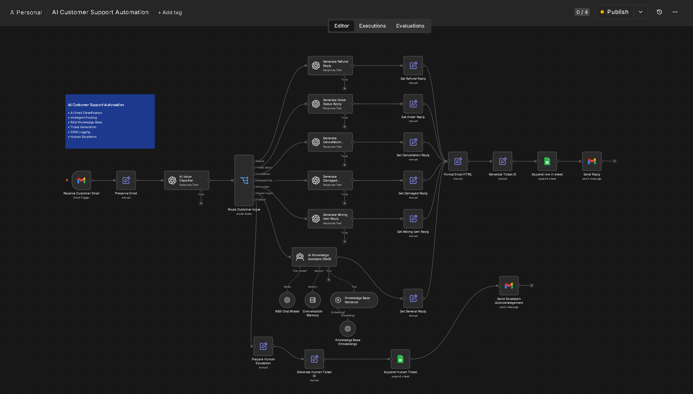
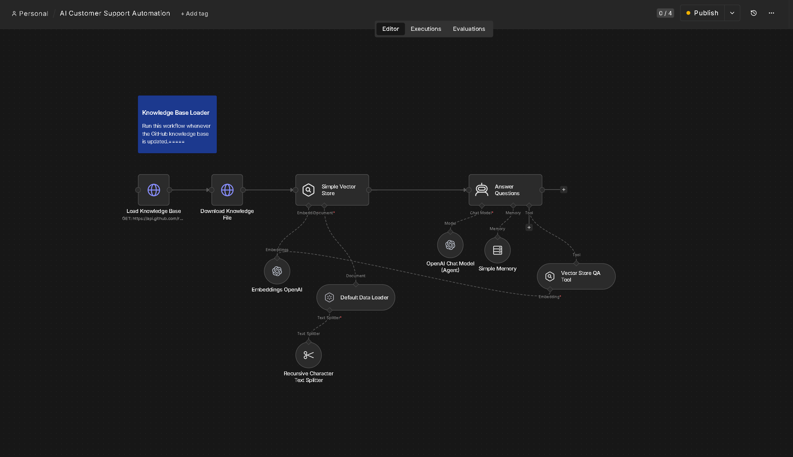
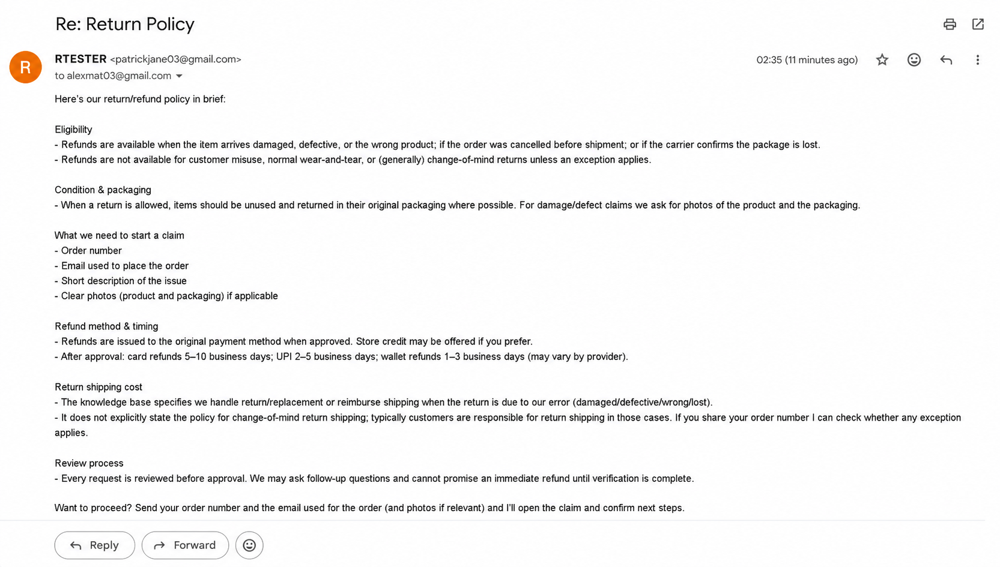
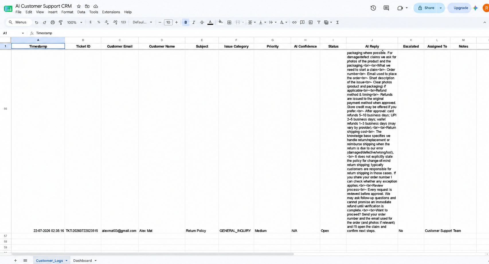

# 🤖 AI Customer Support Automation

An AI-powered customer support automation system built using **n8n**, **OpenAI**, and **Retrieval-Augmented Generation (RAG)** to automate customer support workflows from email reception to AI-powered response generation.

> **Portfolio Project** – Demonstrates AI Automation, Workflow Orchestration, Prompt Engineering, Retrieval-Augmented Generation (RAG), and CRM integration using a real-world customer support use case.

---

# 📌 Project Overview

Modern businesses receive hundreds of repetitive customer support emails every day. Responding manually is time-consuming and inconsistent.

This project automates the complete customer support workflow using Large Language Models (LLMs), workflow orchestration, and a Retrieval-Augmented Generation (RAG) knowledge base.

Instead of simply generating AI responses, the system:

- Receives customer emails automatically
- Classifies customer issues using AI
- Routes requests to specialized AI agents
- Retrieves company policies using RAG
- Generates professional responses
- Creates support tickets
- Logs customer interactions into a CRM
- Escalates complex cases for human review
- Tracks workflow analytics

The entire automation is built visually using **n8n**, making it scalable, modular, and easy to maintain.

---

# 🚀 Features

### 📩 Email Automation

- Gmail Trigger for incoming customer emails
- Automatic AI-generated replies
- Professional email formatting

### 🧠 AI Issue Classification

Automatically identifies customer intent such as:

- Refund Requests
- Shipping Queries
- Order Status
- Cancellation Requests
- Damaged Products
- General Questions

### 🤖 Intelligent AI Routing

Routes requests to specialized AI agents based on issue category, ensuring each response follows appropriate business rules.

### 📚 Retrieval-Augmented Generation (RAG)

Uses a vector store knowledge base containing company policies.

Knowledge Base includes:

- Shipping Policy
- Refund Policy
- Cancellation Policy
- Damaged Product Policy
- Frequently Asked Questions (FAQ)

### 📝 CRM Logging

Automatically records:

- Customer Name
- Customer Email
- Ticket ID
- Issue Category
- Status
- Timestamp

### 🎫 Ticket Generation

Automatically generates unique support ticket IDs for every customer request.

### 👨‍💼 Human Escalation

Flags complex or unsupported customer requests for manual review.

### 📊 Analytics Dashboard

Tracks:

- Total Tickets
- Issue Categories
- Workflow Statistics
- Customer Requests

---

# 📷 Project Screenshots

## Main Workflow



---

## Knowledge Base Loader



---

## AI Email Reply



---

## CRM Logging



---

## Analytics Dashboard


---

# 🏗️ System Architecture

```
Customer Email
      │
      ▼
 Gmail Trigger
      │
      ▼
 AI Issue Classification
      │
      ▼
 Intelligent Routing
      │
      ▼
  RAG Knowledge Base
      │
      ▼
 AI Response Generation
      │
      ├────────► CRM Logging
      │
      ├────────► Ticket Generation
      │
      ├────────► Human Escalation
      │
      ▼
 Customer Reply
```

---

# 🛠️ Technology Stack

| Category | Technologies |
|----------|--------------|
| Workflow Automation | n8n |
| AI Model | OpenAI GPT |
| Knowledge Retrieval | RAG + Vector Store |
| Email Integration | Gmail |
| CRM | Google Sheets |
| Prompt Engineering | OpenAI |
| Documentation | Markdown |
| Version Control | Git & GitHub |

---

# 📁 Project Structure

```
AI-Customer-Support-Automation/

├── assets/
│   └── screenshots/
│
├── documentation/
│
├── knowledge-base/
│   ├── cancellation-policy.md
│   ├── damaged-product-policy.md
│   ├── general-faq.md
│   ├── refund-policy.md
│   └── shipping-policy.md
│
├── workflow/
│   └── main-workflow.json
│
├── README.md
└── .gitignore
```

---

# ⚙️ Workflow Overview

1. Customer sends an email.
2. Gmail Trigger starts the workflow.
3. AI classifies the customer's issue.
4. Request is routed to the appropriate AI agent.
5. Relevant company policies are retrieved using RAG.
6. AI generates a professional response.
7. A support ticket is created.
8. Customer interaction is logged into the CRM.
9. Complex requests are escalated to human support.
10. Analytics dashboard is updated.

---

# 📚 Documentation

Detailed documentation for each development milestone is available in the `documentation/` folder.

Topics include:

- AI Email Automation
- AI Classification & Routing
- Retrieval-Augmented Generation (RAG)
- CRM Logging
- Ticket Generation
- Human Escalation
- Dashboard Analytics
- System Architecture
- Project Evolution

---

# 🚀 Future Improvements

- Multi-language customer support
- Sentiment analysis
- WhatsApp integration
- Slack integration
- Live chat support
- Voice AI support
- Admin dashboard
- Customer authentication
- Multi-agent AI workflows

---

# 👨‍💻 Author

**Reuben Mathew Tharakan**

🎓 B.Tech in Artificial Intelligence & Data Science

GitHub: https://github.com/reubx03

---

# ⭐ If you found this project interesting, consider giving it a star!